# Movie Recommendation & Rating Analysis System (SQL)

This project is a SQL-based system designed to simulate how streaming platforms like Netflix or Amazon Prime analyze user data and provide recommendations.

It stores user information, movies, ratings, and watch history, and performs analysis using SQL queries.

## Features

- Manage users and movies
- Store ratings and watch history
- Find top-rated movies
- Identify popular genres
- Analyze user behavior
- Recommend movies based on similar users
- Find trending movies
- Detect most active users

## Technologies Used

- MySQL
- SQL (Joins, Group By, Aggregations, Subqueries)

## Project Structure

- schema.sql → database and table creation
- data.sql → inserting sample data
- queries.sql → analysis queries

## Screenshots

### Database Creation
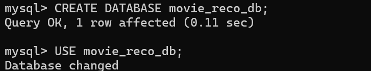

### Table Creation
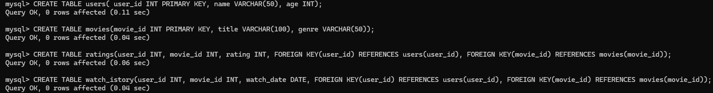

### Insert Data 1
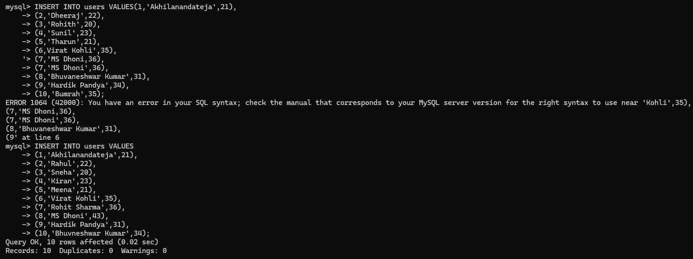

### Insert Data 2
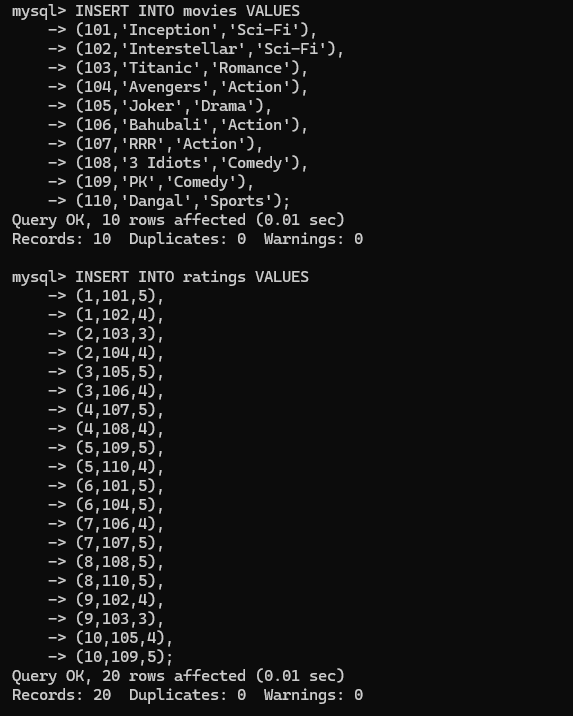

### Insert Data 3
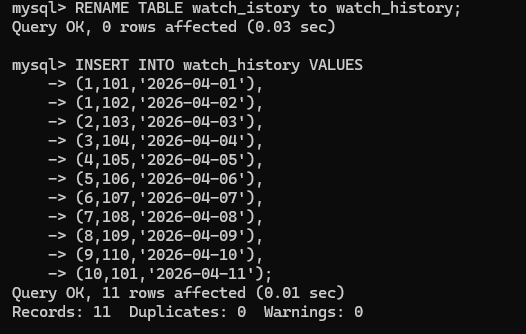

### Display Tables (Users)
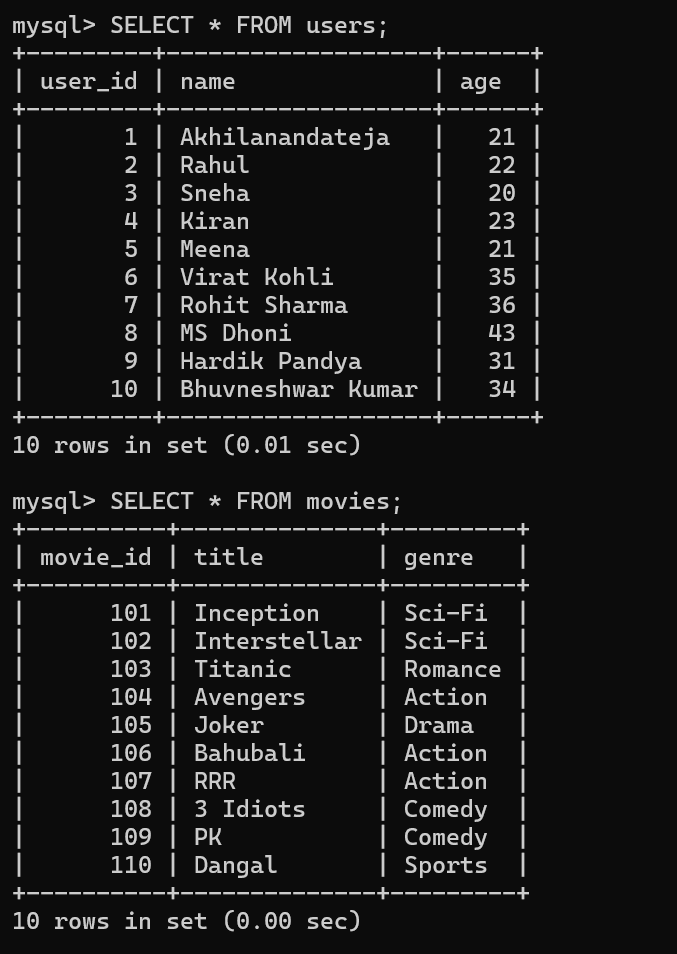

### Display Tables (Movies)
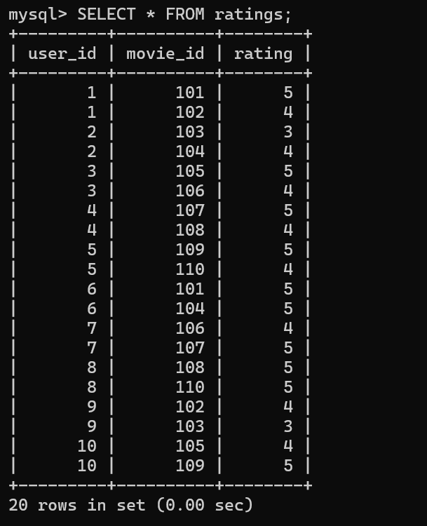

### Display Tables (Ratings/History)
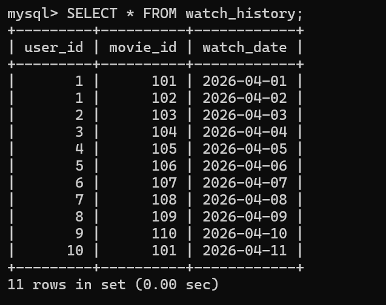

### Top Rated Movies
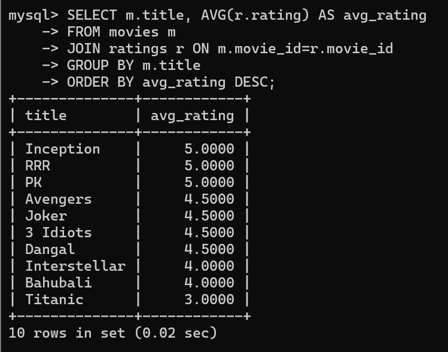

### Popular Genre
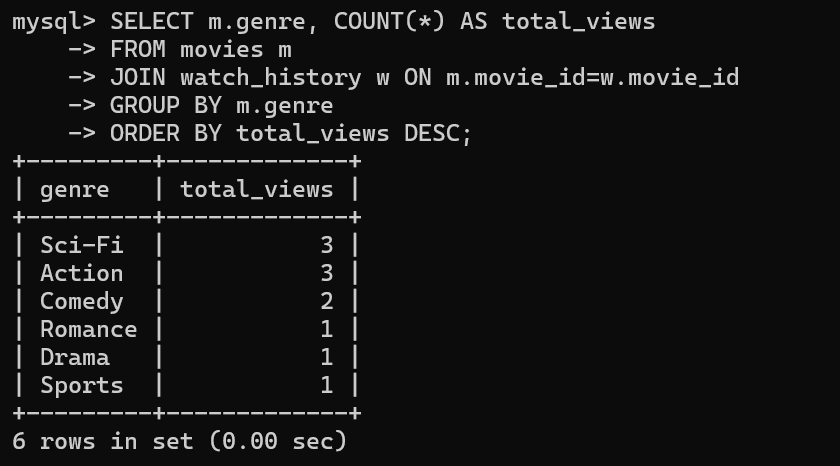

### Trending Movies
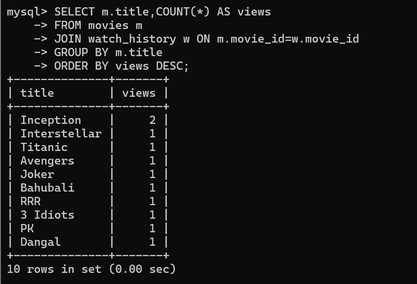

### High Rating Users
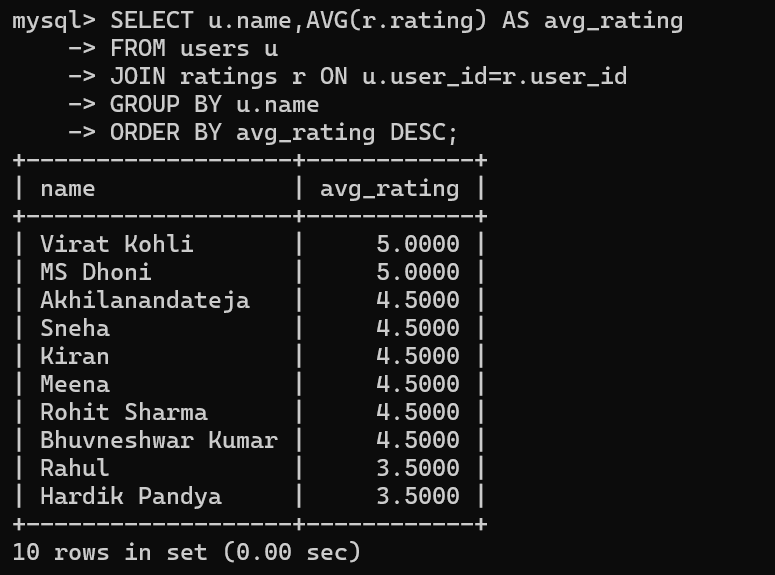

### Most Active User
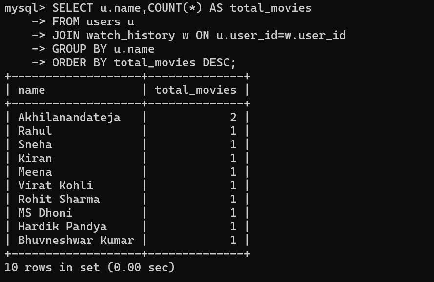

### User Watch History
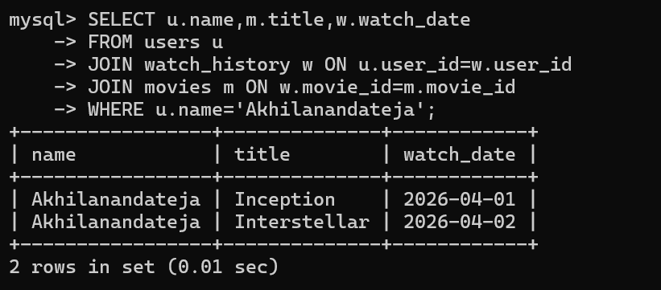

### Basic Recommendation
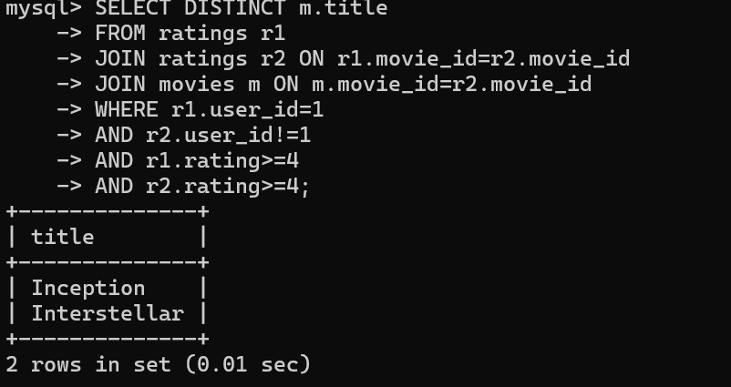

### Unwatched Movies
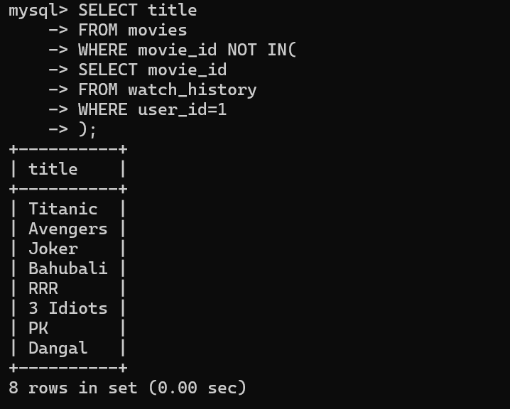

## How to Run

1. Open MySQL
2. Run schema.sql
3. Run data.sql
4. Run queries.sql

## Conclusion

This project demonstrates how SQL can be used to analyze user behavior and build a basic recommendation system. It covers real-world concepts like joins, aggregation, and subqueries, making it useful for understanding data-driven applications.